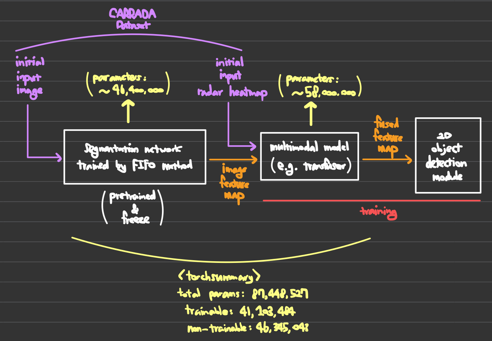
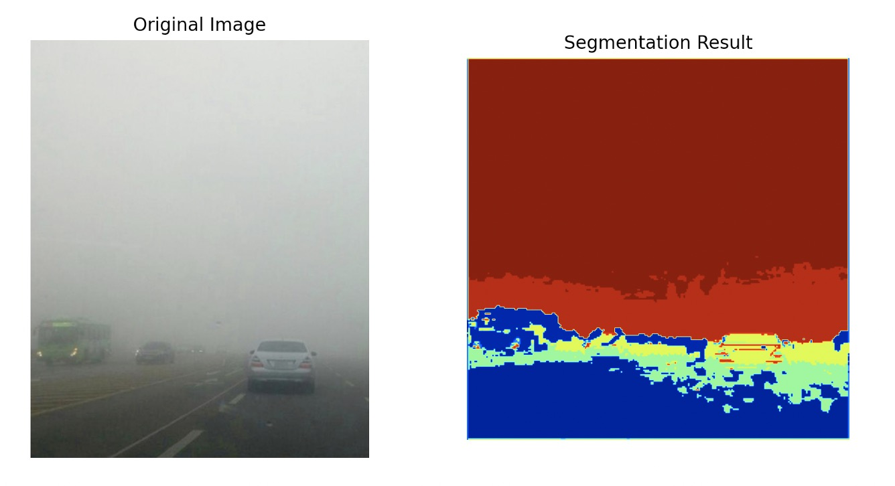

# FIFO+TransFuser Backbone Multimodal Model

## Model Overview

### Description
Designed multimodal (image + radar heat map) TransFuser backbone model (segmentation) on foggy situation
- TransFuser input: radar heat map and output feature map of FIFO model (FIFO generate image feature map that is robust to foggy situations)
- FIFO model input: image

### Model Structure

- Backbone: backbone.py
- .pth file path: ./FIFO_final_model.pth (.pth file can be obtained from FIFO GitHub (see below))

### Inference Test

## Reference
- FIFO: Learning Fog-invariant Features for Foggy Scene Segmentation 
  GitHub: [FIFO](https://github.com/sohyun-l/fifo)
- TransFuser: Imitation with Transformer-Based Sensor Fusion for Autonomous Driving 
  GitHub: [TransFuser](https://github.com/autonomousvision/transfuser?tab=readme-ov-file)
